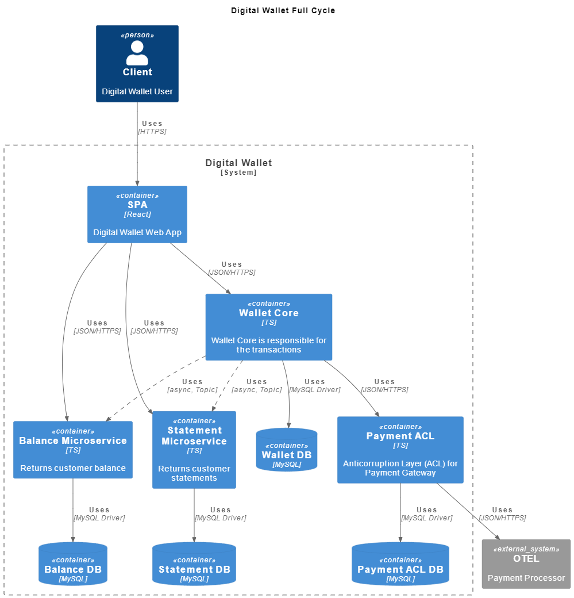
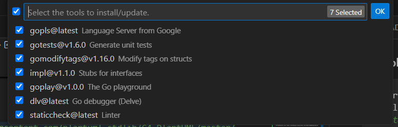

[Repositório do Curso](https://github.com/devfullcycle/fc-eda/tree/main)
# Eventos
- Evento (carregar dados)
- Operações que serão executadas quando um evento é chamado
- Gegerenciador dos nossos eventos/operações
  - Registrar os eventos e suas operações
  - Despachar / Fire no evento para que suas operações sejam executadas


# C4 System Architecture Model



# Dev Environment

## C4 Model

### PlantUML and C4 extenstions for Visual Code
Name: PlantUML
- Id: jebbs.plantuml
- Description: Rich PlantUML support for Visual Studio Code.
- Version: 2.18.1
- Publisher: jebbs
- VS Marketplace Link: https://marketplace.visualstudio.com/items?itemName=jebbs.plantuml


 Name: PlantUML C4 Snippets
- Id: claudineyqr.plantuml-snippets
- Description: Snippets C4-PlantUML for Visual Studio Code
- Version: 1.0.0
- Publisher: Claudiney Queiroz
- VS Marketplace Link: https://marketplace.visualstudio.com/items?itemName=claudineyqr.plantuml-snippets

### graphviz
https://graphviz.org/download/

* ArchLinux
1. Update pacman
```zsh
sudo pacman -Syu
```

2. Install graphviz
```zsh
sudo pacman -S graphviz
```

### Example
```js
@startuml
!include  https://raw.githubusercontent.com/plantuml-stdlib/C4-PlantUML/master/C4_Container.puml

System("System", "System Title", "System Description")

@enduml
```

## Go Language
https://go.dev/doc/install

[Curso do Aprenda Golang](https://www.youtube.com/watch?v=bOlnyWOjVIo&list=PLHPgIIn9ls6-1l7h8RUClMKPHi4NoKeQF)

[Official Go page](https://go.dev/doc/code)

### Init project
```sh
go mod init github.com/uiratan/fullcycle-archdev-microservices/wallet-core
```

### Dependencies

An import path can describe how to obtain the package source code using a revision control system such as Git or Mercurial. The go tool uses this property to automatically fetch packages from remote repositories.

Now that you have a dependency on an external module, you need to download that module and record its version in your go.mod file. 

The `go mod tidy` command adds missing module requirements for imported packages and removes requirements on modules that aren't used anymore.

```sh
go mod tidy
```

```sh
go get github.com/google/uuid
```

Module dependencies are automatically downloaded to the pkg/mod subdirectory of the directory indicated by the GOPATH environment variable. The downloaded contents for a given version of a module are shared among all other modules that require that version, so the go command marks those files and directories as read-only. To remove all downloaded modules, you can pass the -modcache flag to go clean:

```sh
go clean -modcache
```

### VSCode Extensions

Name: Go
- Id: golang.go
- Description: Rich Go language support for Visual Studio Code
- Version: 0.42.0
- Publisher: Go Team at Google
- VS Marketplace Link: https://marketplace.visualstudio.com/items?itemName=golang.Go

Name: Go Test Explorer
- Id: premparihar.gotestexplorer
- Description: Go Test Explorer
- Version: 0.1.13
- Publisher: Prem Parihar
- VS Marketplace Link: https://marketplace.visualstudio.com/items?itemName=premparihar.gotestexplorer


### Go Install/Update tools
```
ctrl + shift + p
```




# Desafio
Desenvolva um microsserviço que seja capaz de receber via Kafka os eventos gerados pelo microsserviço "Wallet Core" e persistir no banco de dados os balances atualizados para cada conta.

Crie um endpoint: `/balances/{account_id}` que exibe o balance atualizado.

## Requisitos para entrega:
- Tudo deve rodar via Docker / Docker-compose
- Com um único docker-compose up -d todos os microsserviços, incluindo o da wallet core precisam estar disponíveis para que possamos fazer a correção.
- Não esqueça de rodar migrations e popular dados fictícios em ambos bancos de dados (wallet core e o microsserviço de balances) de forma automática quando os serviços subirem.
- Gere o arquivo ".http" para realizarmos as chamadas em seu microsserviço da mesma forma que fizemos no microsserviço "wallet core"
- Disponibilize o microsserviço na porta: 3003.

## Rodando as aplicações

Executar `docker compose up --build` na pasta principal.

### Microsserviço wallet-core

Acessar o container

```sh
docker compose exec app-wallet-core bash
```

Rodar a aplicação
```sh
go run cmd/walletcore/main.go
```

As tabelas serão criadas e populadas e a aplicação estará rodando na porta `8080`.

Para acessar o banco de dados
```sh
docker compose exec mysql-wallet bash
mysql -uroot -p wallet
```

### Microsserviço balances

Acessar o container

```sh
docker compose exec app-balances bash
```

Rodar a aplicação
```sh
go run cmd/balances/main.go
```

As tabelas serão criadas e populadas e a aplicação estará rodando na porta `3003`.

Para acessar o banco de dados
```sh
docker compose exec mysql-balance bash
mysql -uroot -p balances
```

### Requisições
Os dois serviços possuem um arquivo `api/client.http` já com os `IDs` populados no banco para testes.

